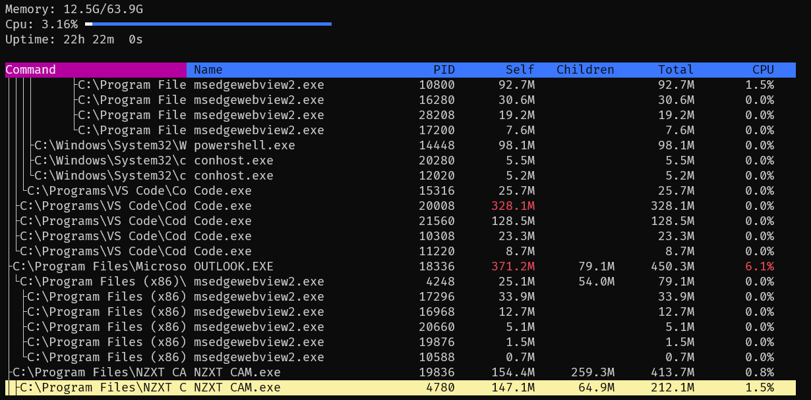

## toprs
Cross platform alternative to `top` with a focus on analysing memory usage.
In addition to each process having only their memory usage, it also has the sum of all child process memory usage. 

## running
Install via for tui and gui:  
`$ cargo install toprs`  
or with tui only and no gui:  
`$ cargo install toprs --no-default-features`  
Run `toprs` for console or `toprs -g` for gui

If you want to always run as Gui mode, add the following to your config file located
- `~/.config/toprs/config.toml` 
- `c:\Users\Name\.config\toprs\config.toml` 
- `/etc/toprs/config.toml` 

```toml
mode="Gui"
```


Gui mode


Memory analysis


SVG


Tui mode


### Operating modes 
Run toprs with the following flags
- Console (TUI) mode [-t]
- GUI mode [-g]    
- Output flamegraph to SVG [-s <filename>]
- Output memory usage to terminal [-o]

### Gui
Processes are listed like in TUI mode, but there is also a memory analysis section which analyses the memory usage in two modes: Sunburst and Flamegraph. 
Sunburst mode allows you to click on a process to drill down. You can increase or decrease the max depth to your preference. 
Both Sunburst and Flamegraph indicate top 5 (own memory) processes in Red, and the rest in fading yellow, depending on amount.
Flamegraph blue portion is child memory, and red/yellow is its own memory

### FAQ
- What memory is it using?
    - In windows this is the "working set" 
    - In Linux this is the "resident" memory i.e. used physical memory


### Dependencies
- Linux (for gui feature):
    - `apt install libwebkit2gtk-4.0-37` (as per tauri)
    - `apt install libwebkit2gtk-4.0-dev`
    - `apt install libgtk-3-0` (as per tauri)
    - `apt install libgtk-3-dev`
    - `apt install libjavascriptcoregtk-4.0-dev`
    - `apt install libpango1.0-dev`
    - `apt install libatk1.0-dev`
    - `apt install libsoup-gnome2.4-dev`
    


### Thanks
Shoutout to the following projects that made this possible:
- rust Sysinfo lib
- GUI mode uses Dioxus to manage window and contents
- TUI mode uses tuirs 
- Plotly for chart
